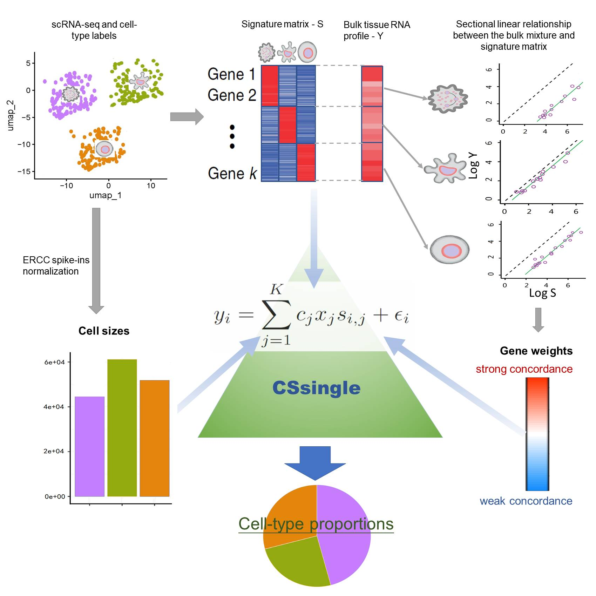

# CSsingle

CSsingle is a unified tool designed for the accurate and robust decomposition of bulk and spatial transcriptomic data into a set of predefined cell types using the scRNA-seq or flow-sorting reference.

CSsingle addresses key challenges in the study of cellular heterogeneity by (i) providing accurate and robust decomposition of bulk and spatial transcriptomic data, (ii) applying cell size correction using ERCC spike-in controls to effectively correct for biases due to inherent differences in total RNA content across cell types, (iii) effectively handling technical and biological variations between individual cell type mixtures and reference signature, and (iv) enhancing fine-scale analysis for spatial transcriptomic data.

<p align="center">

</p>

## Installation

```r
# install devtools if necessary
if (!"devtools" %in% rownames(installed.packages())) {
  install.packages('devtools')
}

# install CSsingle package
if (!"CSsingle" %in% rownames(installed.packages())) {
 devtools::install_github('wenjshen/CSsingle')
}
# load package
library(CSsingle)
```

## Help

Vignette: [HTML Vignette](https://wenjshen.github.io/CSsingle)
