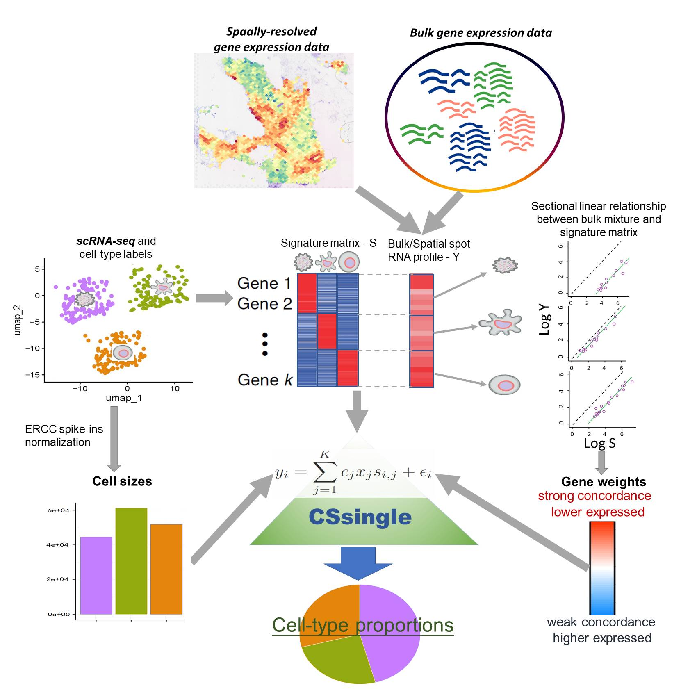

# CSsingle

CSsingle is a unified tool designed for the accurate and robust decomposition of bulk and spatial transcriptomic data into a set of predefined cell types using the scRNA-seq or flow-sorting reference.

CSsingle addresses core challenges in cellular deconvolution through three integrated capabilities: (i) adaptive weighting that leverages marker-gene sectional linearity to achieve robust cross-source harmonization; (ii) integrated cell size correction that accounts for cell-type-specific RNA content differences using either ERCC spike-ins or a novel computational estimator; and (iii) spatially resolved deconvolution enabling fine-grained dissection of tissue microenvironments at single-spot resolution.

<p align="center">

</p>

## Installation

```r
# install devtools if necessary
if (!"devtools" %in% rownames(installed.packages())) {
  install.packages('devtools')
}

# install CSsingle package
if (!"CSsingle" %in% rownames(installed.packages())) {
 devtools::install_github('wenjshen/CSsingle')
}
# load package
library(CSsingle)
```

## Help

Vignette: [HTML Vignette](https://wenjshen.github.io/CSsingle)
