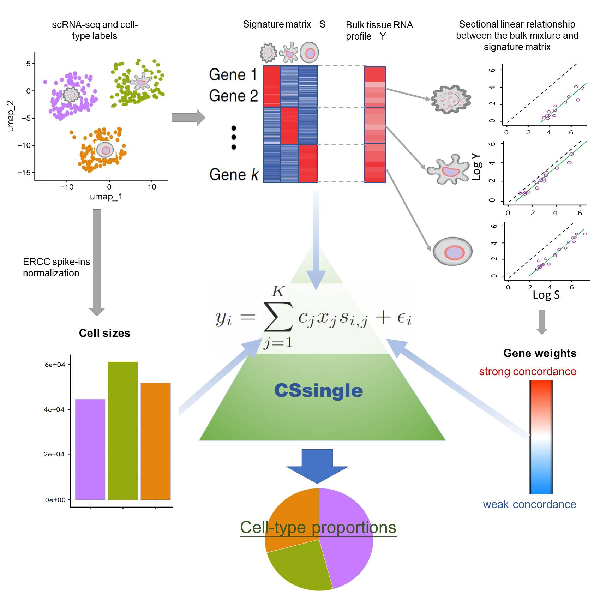

```{r setup, include=FALSE}
knitr::opts_chunk$set(warning = FALSE, message = FALSE, fig.width = 7, fig.height = 6)
```

## Introduction

`CSsingle` (Cross-Source SINGLE cell decomposition) is an R package for accurate and robust decomposition of bulk and spatial gene expression data into a set of pre-defined cell types using the scRNA-seq or flow-sorting reference. `CSsingle` addresses core challenges in cellular deconvolution through three integrated capabilities: (i) adaptive weighting that leverages marker-gene sectional linearity to achieve robust cross-source harmonization; (ii) integrated cell size correction that accounts for cell-type-specific RNA content differences using either ERCC spike-ins or a novel computational estimator; and (iii) spatially resolved deconvolution enabling fine-grained dissection of tissue microenvironments at single-spot resolution.

<style>
figure{
  text-align: center;
}
</style>

<figure>
<p align="center">
{width="90%"}

## Installation

```{r, message = FALSE}
# install devtools if necessary
if (!"devtools" %in% rownames(installed.packages())) {
 install.packages('devtools')
}

# install the CSsingle package
if (!"CSsingle" %in% rownames(installed.packages())) {
 devtools::install_github('wenjshen/CSsingle')
}

# load required packages
library(CSsingle)
library(Seurat)
library(Biobase)
library(nnls)
library(ggplot2)
library(ggpubr)
library(ggrepel)
library(gridExtra)
```
We reproduce here the analysis detailed in CSsingle manuscript:

## Example 1: Cell type decomposition in whole blood samples with ground-truth cell type proportions from flow cytometry measurements

### Load single-cell reference data in the form of a `SeuratObject`

```{r}
data("GSE60424_sc")
sc.eset <- GSE60424_sc
```

### Load bulk data in the form of an `ExpressionSet`

```{r}
data("WholeBlood_RNAseq")
bulk.eset <- WholeBlood_RNAseq
```

### Data preprocessing

This step involves excluding cell types that are not of interest from the scRNA-seq data, removing sparse features and cells, and trimming both bulk and scRNA-seq data to ensure they share the same features.

```{r}
cellType = "cellType"
prepData = preprocessData(bulk.eset, sc.eset, cellType)
bulk.eset = prepData$bulk.eset
sc.eset = prepData$sc.eset
```

### Build a differentially expressed matrix

```{r}
# Performing differential expression analysis on the scRNA-seq data
res <- build_diffexpMat(sc.eset, cellType)
ctDEGs <- res$ctDEGs
diffexpMat <- res$diffexpMat
designMat = res$designMat
```

### Estimation of cell type proportions by `CSsingle-Comp`

```{r}
# In the absence of ERCC spike-ins, CSsingle applies a computational framework that estimates cell size coefficients from endogenous gene expression.
res.CSsingle_Comp <- CSsingle_optimize(designMat, diffexpMat, exprs(bulk.eset), ctDEGs, dampened = TRUE, tune.correction = TRUE, n_cores = 4)
Est.prop.CSsingle_Comp <- res.CSsingle_Comp$Est.prop
```

```{r}
# Compare estimated versus ground-truth cell type proportions from flow cytometry measurements.
prop.real = as.matrix(pData(bulk.eset)[c(1,3,5:8)])
prop.real <- prop.real / rowSums(prop.real)
Est.prop.CSsingle_Comp <- Est.prop.CSsingle_Comp[rownames(prop.real), colnames(prop.real)]
data = cbind.data.frame(c(prop.real), c(Est.prop.CSsingle_Comp))
colnames(data) = c("Real", "Estimated")
data$Celltype =  rep(colnames(prop.real), each = nrow(prop.real))
data$Celltype = gsub("_", " ", data$Celltype)
data$Sample = rep(rownames(prop.real), ncol(prop.real))
colors <- c(
 '#d62728', '#008000', '#0000ff', '#9467bd',
  '#00ffff', '#ff00ff'
)
names(colors) <- gsub("_", " ", colnames(prop.real))
gplot <- ggplot(data=data, aes(x=Real,y=Estimated))+
geom_abline(intercept=0, slope=1, linetype="dashed")+labs(title = "CSsingle-Comp", x="Actual cellular fraction", y="Estimated cellular fraction")+
geom_point(aes(color=Celltype, shape = Celltype), size=4)+
scale_color_manual(values=colors)+
stat_cor(method="pearson", label.sep = "\n", label.y = 0.9)+
theme_bw()+theme(legend.title = element_text(size = 12), legend.text = element_text(size = 12), legend.key.size = unit(0.8, "lines"),legend.key.height = unit(0.6, "lines"),legend.spacing.y = unit(0.06, "cm"))+
scale_x_continuous(limits = c(0, 1)) +  # Set x-axis limits
 scale_y_continuous(limits = c(0, 1)) +  # Set y-axis limits
 coord_cartesian(xlim = c(0, 1), ylim = c(0, 1))
print(gplot)
```

## Example 2: Cell type decomposition in estimating neutrophil-to-lymphocyte ratio (NLR) from whole blood samples

### Load single-cell reference data in the form of a `SeuratObject`

```{r}
data("GSE107011_sc")
blood_ref <- GSE107011_sc
```

### Calculate cell size by using ERCC spike-in controls

```{r}
cellType <- "cellType"
cellSize <- cal_cellSize(blood_ref, cellType)
# remove ERCC spikes-ins
is.spikes <- grepl("^ERCC-", rownames(blood_ref))
blood_ref <- blood_ref[!is.spikes, ]
```

### Load bulk data in the form of an `ExpressionSet`

```{r}
data("GSE73072_SI_bulk")
blood_bulk <- GSE73072_SI_bulk
```

### Data preprocessing

This step involves excluding cell types that are not of interest from the scRNA-seq data, removing sparse features and cells, and trimming both bulk and scRNA-seq data to ensure they share the same features.

```{r}
select.ct <- c("lymphocyte", "Neutrophils_LD", "myeloid")
prepData <- preprocessData(blood_bulk, blood_ref, cellType, select.ct)
bulk.eset <- prepData$bulk.eset
sc.eset <- prepData$sc.eset
cellSize <- cellSize[select.ct]
```

### Build a differentially expressed matrix on the scRNA-seq data

```{r}
res <- build_diffexpMat(sc.eset, cellType, normalization.mode = "cell-average", test.use = "bimod")
ctDEGs <- res$ctDEGs
diffexpMat <- res$diffexpMat
designMat = res$designMat
```

### Estimation of cell type proportions by `CSsingle-ERCC`
### For single-cell reference datasets containing ERCC spike-in controls, we compute cell size coefficients directly from spike-in RNA counts. When ERCC controls are unavailable, users should set `cellSize = NULL`.

```{r}
# Estimation of cell type proportions by selecting the top 150 markers (set `increment = 150`) for each cell type
res.CSsingle_ERCC <- CSsingle_optimize(designMat, diffexpMat, exprs(bulk.eset), ctDEGs, cellSize = cellSize, dampened=T, increment = 150, rm.dupli = TRUE, tune.correction = FALSE, n_cores = 4)
Est.prop.CSsingle_ERCC <- res.CSsingle_ERCC$Est.prop
markers <- res.CSsingle_ERCC$opt_markers
sigMat <- res.CSsingle_ERCC$opt_sigmat
num_top <- res.CSsingle_ERCC$opt_num_top
```

### Plot the temporal alterations in the `NLR`, as assessed by `CSsingle-ERCC`, against those observed in laboratory white blood cell counts

```{r}
# We collected the laboratory measurements of neutrophil/lymphocyte counts from Table S6 of a previous published study (PLoS Genet. 2011 Aug;7(8):e1002234.)
data("wbc_counts")

neut <- wbc_counts[,"Neutrophils"]
neut <- neut[seq(2,length(neut),2)]
neut <- c(mean(neut[c(1,2)]),neut[c(-1,-2)])
lymp <- wbc_counts[,"Lymphocytes"]
lymp <- lymp[seq(2,length(lymp),2)]
lymp <- c(mean(lymp[c(1,2)]),lymp[c(-1,-2)])
nlr <- neut/lymp
time.slot <- list(c(-Inf,0),c(0,24),c(24,2*24),c(2*24,3*24),c(3*24,4*24),c(4*24,5*24),c(5*24,6*24),c(6*24,7*24))
label <- c("Baseline","Day1","Day2","Day3","Day4","Day5","Day6","Day7")
Lymp <- Est.prop.CSsingle_ERCC[, "lymphocyte"]
Neut <- Est.prop.CSsingle_ERCC[, "Neutrophils_LD"]
NLR <- Neut/Lymp
meta <- pData(bulk.eset)[names(Neut),]

mean.nlr <- c()
for (j in 1:length(time.slot)){
  idx <- as.numeric(meta$time.hours) <= time.slot[[j]][2] & as.numeric(meta$time.hours) > time.slot[[j]][1]
  mean.nlr[j] <- mean(NLR[idx])
}
dataf <- cbind.data.frame(nlr, mean.nlr, label)

gplotr <- ggscatter(dataf,x="nlr",y="mean.nlr",fill="label",
                   shape=21,size=5.5,add = "reg.line",add.params = list(fill="darkgrey",color="black"),conf.int=T,ylab="Mean estimated NLR",
                   xlab="Laboratory measured NLR", title = "CSsingle-ERCC")+ ylim(c(0.5,3.5))+        geom_abline(intercept=0, slope=1, linetype="dashed", lwd = 1) +
  stat_cor(method="pearson")+theme(legend.position = "none")+
  geom_text_repel(aes(y=mean.nlr, x=nlr, label = label))

print(gplotr)
```

## Example 3: Cell type decomposition in 10x visium mouse brain cortex

### Load single-cell reference data in the form of a `SeuratObject`

```{r}
data("GSE71585_sc") 
sc.eset <- GSE71585_sc
rownames(sc.eset) <- toupper(rownames(sc.eset))
```

### Load spatial transcriptomic data in the form of a `SeuratObject`

```{r}
data("mouse_brain_st")
st_count = mouse_brain_st[["anterior1"]]$counts
```

### Build a differentially expressed matrix on the scRNA-seq data

```{r}
cellType <- "subclass"
res <- build_diffexpMat(sc.eset, cellType, test.use = "wilcox")
ctDEGs <- res$ctDEGs
diffexpMat <- res$diffexpMat
designMat = res$designMat
```
### Perform enrichment analysis to identify cell types enriched in each spatial transcriptomics spot

```{r}
enrich.ct <- run_enrichment(
  diffexpMat,
  st_count,
  ctDEGs,
  rm.dupli = F,
  enrich.thres = 0
  )
```

### Estimation of cell type proportions by `CSsingle-Spatial`

When estimating cell type proportions using `CSsingle-Spatial`, omit cell size correction (set `cellSize = NULL` and `tune.correction = FALSE`) for ST deconvolution. This is because incomplete cellular capture by 2D slides and stochastic cell overlaps dominate RNA contributions, obscuring biological size differences.

```{r}
# Build a signature matrix by selecting the top 50 markers for each cell type
res.CSsingle_Spatial <- CSsingle_optimize(designMat, diffexpMat, st_count, ctDEGs, enrich.ct = enrich.ct, dampened = TRUE, increment = 50, n_cores = 4)
Est.prop.CSsingle_Spatial <- res.CSsingle_Spatial$Est.prop
```

OR

```{r}
# To optimize the cell-type signature matrix, we generated multiple candidate matrices by varying the number of marker genes per cell type from 50 to 200, in increments of 50 (using the default `increment` setting). For each candidate matrix, we applied CSsingle to estimate cell-type proportions, then reconstructed the bulk/ST gene expression. The optimal signature matrix $S^*$ was selected as the candidate that yielded reconstructed gene expression data with the highest Spearman correlation relative to the observed bulk/ST data
res.CSsingle_Spatial <- CSsingle_optimize(designMat, diffexpMat, st_count, ctDEGs, enrich.ct = enrich.ct, dampened = TRUE, n_cores = 4)
Est.prop.CSsingle_Spatial <- res.CSsingle_Spatial$Est.prop
```

### Visulization of cell-type spatial distribution

```{r}
# scatterpie plot
library(scatterpie)
mycol <- c("royalblue", "red", "purple", "darkolivegreen1", "orange", "forestgreen",
              "cyan","brown", "pink")

plot_data <- as.data.frame(Est.prop.CSsingle_Spatial)
plot_col <- sort(colnames(plot_data))
spatial_loc <- GetTissueCoordinates(mouse_brain_st[["Brain.anterior"]][["centroids"]])
plot_data$x <- as.numeric(spatial_loc$x)
plot_data$y <- as.numeric(spatial_loc$y)
min_x <- min(plot_data$x)
rad <- 100
plot_data$radius <- rad
df <- data.frame()
p <- ggplot(df) + geom_point() + xlim(min(plot_data$x)-rad, max(plot_data$x)+rad) + ylim(min(plot_data$y)-rad, max(plot_data$y)+rad) + labs(title = "CSsingle-Spatial") + xlab("x coordinates") + ylab("y coordinates")
pieplot <- p + geom_scatterpie(aes(x=x, y=y, r=radius), data=plot_data, cols=plot_col, alpha=.8) +
  geom_scatterpie_legend(plot_data$radius, x=1, y=1) + theme_classic() +
  scale_fill_manual(name = "Cell type", values = mycol)
print(pieplot)
```
